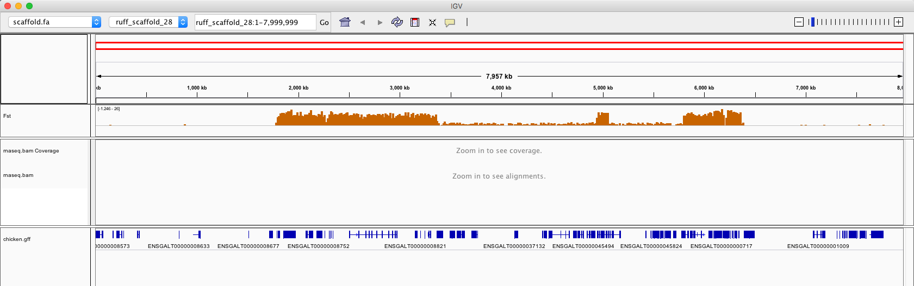
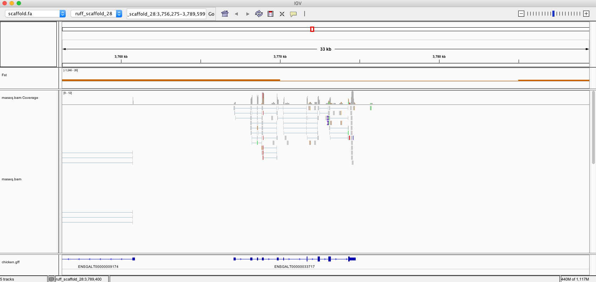
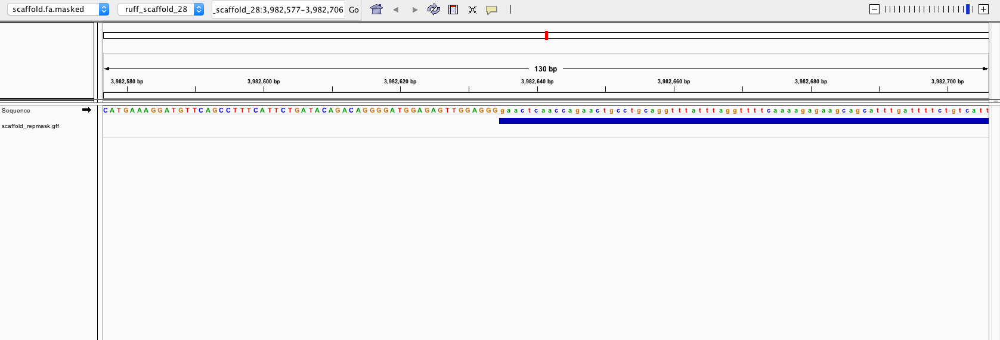

 
# Overview

The following exercices will introduce you to methods in eukaryotic genome annotation. The following topics will be discussed in order:

**A. Crash course/lecture**  
 * Insights into eukryotic genome annotation *(not included in this wiki)*  
  
  
**B. Practical course**  
 * **B1.** Genome Browsers  
 * **B2.** Understanding male morphs in the ruff (*Philomachus pugnax*) - a genomics approach  

Note: the exercises are split into two separate tasks (B1 and B2). We suggest that you take a look at B2 first, as it requires a bit more runtime on your computer. While B2 is running, you can get started on B1.   

# B1. Genome Browsers  
Genome browsers are an important tool for anyone working with eukaryote genome sequences. They can help visualize rich data sets and are often critical to the biological interpretation of findings from wet-lab or sequencing experiments.  
It is important to familiarize yourself with these resources so you understand what kind of features can be annotated and where to find this type of information.  
Try out the following URLs to get an impression of different Genome-Browser flavours. What features/annotations do these browsers offer? How do they display them? If you need some inspiration regarding which genes to inspect in EnsEMBL and UCSC, you can start with these:  
BRCA1, BRCA2, HOXA1  
* Ensembl Genome Browser (http://www.ensembl.org/index.html)
* UCSC Genome Browser (http://genome.ucsc.edu)
* NCBI's Genome Data Viewer (https://www.ncbi.nlm.nih.gov/genome/gdv/)
* Metazome (http://www.metazome.net)  

Once you have done that, try completing the following tasks using the EnsEMBL genome portal linked above.  

**QB1.1:** How many protein-coding genes are annotated in the mouse (check the info page for mouse, accessible from the front page and then search for annotation statistics).  

**QB1.2:** How many non-coding genes are annotated in human? And in chicken?  

**QB1.3:** How many transcript variants are annotated in EnsEMBL for the human BRCA1 gene?  
How long is the longest protein product, how long the shortest?  

**QB1.4:** Are there differences between UCSC and EnsEMBL in BRCA1 number of transcripts?  (for UCSC, count the RefSeq transcripts)

**QB1.5:** What is the biological function of BRCA1? (you can check "Ontologies" --> "Molecular function")

**QB1.6:** In which diseases are BRCA1 and BRCA2 involved? (check "External references")

**QB1.7:** What are the external descriptors/ids for these genes (indicated by '*') and phenotypes/diseases (indicated by '#') in OMIM(MIM)?

**QB1.8:** Do orthologs of BRCA2 exist in chicken? (check EnsEMBL "Gene tab" --> "orthologs/paralogs")  
If yes, what is the gene id?

**QB1.9:** How deeply conserved (i.e. across taxonomic groups) is the TEX14 gene? ("Gene tab" --> "Comparative genomics" --> "gene tree")

**QB1.10:** How many exons does the TEX14 transcript with the longest protein product have? ("Gene tab" --> "Summary" --> "Show transcript table", then click on the transcript id)  
How many of these are coding exons?  
How long is the transcript, how long the protein product?  

**QB1.11:** In which tissues is the TEX14 gene strongly expressed? ("Gene tab" --> "External data" --> "Gene expression", scroll sideways to see all tested tissues)

**QB1.12:**  Which parts of the HOXA1 gene are most conserved across 37 mammalian genomes? ("Location tab" --> "Configure this page" --> "Comparative genomics", enable the correct track)  

**QB1.13:** Use EnsEMBL to get the protein sequence for the canonical (i.e. the dominant) transcript of the HOXA1 gene and blast it against the human proteome using the Blast/Blat tool provided by EnsEMBL (top of the page). How many hits do you find?  
What are the top-ranked proteins?  

# B2. Understanding male morphs in the ruff (*Philomachus pugnax*) - a genomics approach  
One of the key goals of genome sequencing is to understand biological phenomena on a molecular level. Examples include the cause of genetic diseases as well as phenotypic or even behavioral traits. A nice example of the latter was published in the journal Nature Genetics in 2015 by Swedish researchers [(Lamichhaney et al. Nature Genetics, 2015)](https://www.nature.com/articles/ng.3430). They had observed that a Nordic bird species known as "ruff" (German: "Kampfläufer) has not one but three different male morphs. Male morphs are thought to be a display of fitness to attract mates. The morhps in the ruff are special though. In addition to the typical "ornamented" male (known as "Independents") there are also "Satellites" and "Feaders".  
    
*(picture from Farrell et al. 2013)*  

While the "normal" ("Independents") males make up 80-95% of the population, "Satellites" are found at frequencies of 5-20% and "Feaders" at less than 1%. Biologically, "Satellites" look similar to "Independents", with the exception that they have white, not colored feather ornaments and behave very passively. "Feaders" look almost like females and only have success mating when approaching females while the other males are busy "showing off".  

There are almost no other examples from the animal kingdom where such a mating system exists. It was initially unclear how this could be explained genetically and why the less abundant morphs persist and are not outcompeted by the "Independent" phenotype. To answer the question, a genome sequence was generated.  

In this exercise, you will analyze **_scaffold28_** of the ruff draft genome sequence and re-trace the analysis performed by the authors to see if you can repeat their results. For this, you will annotate the scaffold, assign functions to the predicted protein products and compare the data with reference information to create a first hypothesis that can explain the male morph phenotypes.  

## B2.1. Setting up  

You will execute the following tasks on the command line. If you are new at this, you can have a look at one of these cheat sheets for help: 

https://learncodethehardway.org/unix/bash_cheat_sheet.pdf 

https://www.git-tower.com/blog/command-line-cheat-sheet/ 

*We recommend that you type the commands yourself instead of copy-pasting, as it will then become more clear what you are doing at each step. Remember that you can press the "tab" key to autocomplete file and directory names; also the "up arrow" key will show you the commands that you previously typed.* 

For these exercises you will need the **IGV genome browser**. The program can be found in the folder `/mnt/lectures/biol258/Day7/IGV` and you can copy it to your home directory like so:  
`cp -R /mnt/lectures/biol258/Day07/IGV $HOME`  

*Please note! The commands given in this wiki are examples and they assume that you make sure that the input and output files are where they should be.*  
*Sometimes you may have to copy files to your current directory or expand the example commands to include correct/full paths!*  
  

Data for the exercises is located in the folder `/mnt/lectures/biol258/Day07/B2`.  

Copy that folder to your $HOME directory:  
`cp -R /mnt/lectures/biol258/Day07/B2 $HOME/Day07`  

The copy in your home folder is where you will run the following analyses. The different data can be found in the various subfolders:  

**1) The genome sequence (scaffold28):** `genome/scaffold.fa`  
Load this into IGV ("Genomes" --> "Load from file")  
This is only a fragment of scaffold28, as the analysis with the full sequence would take too long.

**2) Fixation index data (Fst):** `Fst/Fst.bedgraph`  
Load this into IGV ("File" --> "Load from file")  
This data was generated through genomic resequencing and used to identify the region on scaffold28 that differs between the male morphs. High values suggest drastic differences.  

**3) RNA-seq data (Bam):** `rnaseq/rnaseq.bam`  
Load this into IGV ("File" --> "Load from file")  
The BAM file includes mapped transcriptome reads. These can be used to visualize the raw read data in IGV as well as to generate splicing "hints" for the gene finder tool.  

**4) Chicken "lift-over" (gff):** `liftover/chicken.gff`  
Load this into IGV ("File" --> "Load from file")  
This file contains gene models from the corresponding genomic region in chicken, superimposed onto the ruff scaffold. Projecting annotations between different species is a common way to perform simple comparative genomics and guide annotation efforts by providing a "reference".  

**5) Uniprot data (fasta):** `uniprot/uniprot_birds.fasta`  
Uniprot is a popular protein database that includes high-confidence as well as predicted protein sequences from a wide range of organisms. This dataset includes validated protein sequences from chicken, duck and zebra finch. Only protein sequences locating to our genomic region of interest are included to reduce the runtime of the annotation step.  

**6) Transcripts (fasta):** `transcritps/transcripts.fasta` 
This file contains the nucleotide sequence of transcripts assembled from the raw RNA-seq reads.   

You should see this: 

 

If you zoom in you can see the RNA-seq reads as well: 

 

On the panel on the left side, you can right-click a track to rename it, change its color or expand/colapse it. 

### Software containers  
Many of the tools used in this exercise are pretty complex to install. In order to avoid having to install them on each computer we are going to use software *containers*. These are *portable* environments in which you can install an operating system, a program or many programs and then copy the whole thing to whichever computer you like to run the software. Popular solutions are Docker and **Singularity** (which we will use here). The way to run a tool inside a container is pretty straight-forward:  

If you would run a command without container like this:  
`samtools sort -o rnaseq.sorted.bam rnaseq.bam`  

You would run the same command with a container like this:  
`singularity exec container.img samtools sort -o rnaseq.sorted.bam rnaseq.bam`  

Here `container.img` is a place holder, which you have to replace by the name of the actual container.  

Copy the singularity image for this exercise to your local hard drive:  
`cp -R /mnt/lectures/biol258/Day07/singularity.img $HOME`  

In order to be able to run the examples in the following exercises, you will have to add the following code in front of each command:  
`singularity exec $HOME/singularity.img <command execution here>`  

## Annotating the ruff  
Annotation of eukaryote genomes commonly includes these steps: repeat masking, generating "evidences" from sequence data (proteins, transcripts) and combining these with gene finding tools that can use the evidence to generate "best-guess" gene models.   

## B2.2. Repeat-masking the genome  
Identifying repetitive motifs in an eukaryotic genome sequence is important prior to annotation as repeat sequences are abundant but usually not part of actual protein-coding genes. Excluding them from the annotation process can therefore increase the quality of resulting gene models. The most popular tool for this purpose is **RepeatMasker**. It comes with a range of reference repeat sequences and uses a special version of BLAST (and some other tools) to annotate repetitive motifs.  

To repeat-mask scaffold28, you can run RepeatMasker like so:  
`RepeatMasker -pa 4 -qq -species aves -xsmall scaffold.fa`  

This will invoke RepeatMasker, using 4 CPUs (`-pa`), the bird reference repeat sequences (`-species`) and output a repeat-masked version of the scaffold ("soft"-masked because we specified `-xsmall`). In addition, we are using the `-qq` flag to speed up the process (at the cost of sensitivity). The following output files will be created (in the directory where the genome file is):  

`scaffold.fa.masked`: the "soft"-masked genome sequence. 
In "soft"-masking, repeats are written in lower-case, all other nucleotides upper-case. In contrast, in "hard"-masking repeats are replaced by "N"s.  

`scaffold.fa.out`: a list of repeat features.  

`scaffold.fa.tbl`: a summary of the repeat annotation.  

**QB2.1:** How many repeats were annotated in scaffold28? (use the command `wc -l` to check the number of lines of the file `scaffold.fa.out`)  

**QB2.2:** How many of those are "LINE" elements? (check `scaffold.fa.tbl`)  

**QB2.3:** Look at the first lines of the repeat-masked genome (type `head scaffold.fa.masked` to see the first 10 lines), have any of the first nucleotides been masked? 

**QB2.4:** What is the position of the first repeat?  

Annotators spend a lot of time just adjusting file formats to follow the rules of different programs. `scaffold.fa.out` has a column format similar to GFF, but not quite the same. We could transform it into GFF format like so: (be careful if you copy and paste, it's a single line of code!)  

`cat scaffold.fa.out | tail -n +4 | perl -ne 'chomp; s/^\s+//; @t = split(/\s+/); print $t[4]."\t"."repmask\tnonexonpart\t".$t[5]."\t".$t[6]."\t0\t.\t.\tclass=".$t[10].";src=RM\n";' > scaffold_repmask.gff` 

Check in a text editor that `scaffold_repmask.gff` has GFF format (9 columns). 

Load the masked genome `scaffold.fa.masked` ("Genomes" --> "Load from file") and the annotated repeats `scaffold_repmask.gff` ("File" --> "Load from file") into IGV. Zoom-in until you can see the nucleotides. 

**QB2.5:** Can you find an example of a soft-masked sequence based on the annotated repeats? Write its coordinates.  

*Example:*
 

## B2.3. Annotating with AUGUSTUS  

Gene finders may either use generic "profiles" to predict genes, or specifically trained hidden-markov models (HMM) that more accurately reflect the sort of sequence motifs associated with genes in a particular species or taxonomic clade. Usually, these are trained on a large set of manually curated (verified) gene structures from high-quality reference genome(s).  

**AUGUSTUS** is a gene prediction tool that uses HMMs (optionally combined with "evidence" data from sequence alignments) to find gene models in a genome sequence. For the ruff, we can use the chicken profile models. Birds have fairly well-conserved gene structures and sequences. As sequence, use the repeat-masked scaffold you generated in the previous section (`scaffold.fa.masked`).  

To execute AUGUSTUS type:  
`augustus --species=chicken --gff3=on scaffold.fa.masked > augustus.abinitio.gff3`  

This will start AUGUSTUS, using chicken as profile (`--species`) and write the output in GFF3 format (which is the standard for annotations). The output file will be called `augustus.abinitio.gff3`.  

You can load this file into IGV and check what sort of gene models AUGUSTUS predicted for scaffold28. To judge the quality of the models, you can visually compare them in IGV to the chicken lift-over gene structures.  

*If you have loaded the `scaffold.fa.masked` sequence in the previous section, you will only have the `scaffold_repmask.gff` track. Plase load again the files `Fst.bedgraph`, `rnaseq.bam` and `chicken.gff`.* 

**QB2.6:** Can you find an augustus prediction that is the same or very similar to the chicken lift-over? Write its name ("gXX"). (The chicken lift-over has UTR information, but AUGUSTUS has not predicted them in the way we have run it. Search similar predictions based only on coding sequence).  

**QB2.7:** Go to position 7,460 kbp. Augustus has predicted gene g149 as a merge of the chicken genes ENSGALT00000001245 and ENSGALT00000001289. Based on the RNA-seq evidence, which gene structure do you think is right?  

**QB2.8:** Go to position 6,180 kbp. Augustus has predicted gene g112 as a merge of the chicken genes ENSGALT00000000717 and ENSGALT00000000179. Based on the RNA-seq evidence, which gene structure do you think is right? 

## B2.4. Re-run AUGUSTUS with "hints" from RNA-seq experiments  

In the previous example, you ran AUGUSTUS *ab initio*, without any external evidence. However, as you will learn with the course, there is a very good source of information for the presence of introns and exons in a genome sequence: RNA-seq data. As RNA-seq is a snapshot of what is transcribed from a genome, it would be useful to tell AUGUSTUS where there should be an intron or an exon instead of having it guess it. This is called "providing hints". So, let's generate hints and run AUGUSTUS again.  

**1)** Convert the RNA-seq BAM file into hints for AUGUSTUS (fill in file names as appropiate):  

`samtools sort -n rnaseq.bam > rnaseq.sorted.bam`  

`filterBam --uniq --in rnaseq.sorted.bam --out rnaseq.sorted.filtered.bam`  

`samtools sort rnaseq.sorted.filtered.bam > rnaseq.sorted.filtered.final.bam`  

`bam2hints --intronsonly --in=rnaseq.sorted.filtered.final.bam --out=hints_rnaseq.gff`  

Open the hints file in a text editor and look at the information. We have generated hints in GFF format, in this case specifying the location of introns. See that the third column is "intron" for every row, because these are "only" hints. In contrast, GFF files that report gene annotations (like the output of AUGUSTUS) must contain a combination of "gene", "mRNA", "exon", "CDS" and "intron" features. 

One interesting bit is the key-value pair "multi", as it tells AUGUSTUS how well supported this particular hint is (i.e. how many reads in the RNA-seq alignment cover this hint). The more support a hint has, the stronger it is being considered.  

**2)** Run AUGUSTUS with the newly generated hints:  

`augustus --species=chicken --extrinsicCfgFile=$AUGUSTUS_CONFIG_PATH/extrinsic.E.cfg --gff3=on --hintsfile=hints_rnaseq.gff scaffold.fa.masked > augustus.with.E.hints.gff3`  

Note that this step takes a bit longer than before, as all predictions made by AUGUSTUS are not only ranked by how well they fit the model but also how well they fit the hints. The key here is the `extrinsic.E.cfg` file, which tells AUGUSTUS how to weigh the hints when predicting gene models (i.e. give them a high or low priority).  

**3)** Load the hint-supported gene models into IGV:  

You can now compare the lift-over chicken annotation with your initial AUGUSTUS predictions and the predictions guided by intron hints. Has the addition of intron hints improved the gene prediction?  

**QB2.9:** Check position 7,460 kbp again. Has the use of RNA-seq hints improved the annotation? 

**QB2.10:** Check position 6,180 kbp again. Has the use of RNA-seq hints improved the annotation? Zoom-in to the nucleotide level at position 6,178,780 bp. Can you see any problematic sequence that could difficult the prediction of gene structure? 

**QB2.11:** Can you find another AUGUSTUS prediction that has been improved by the use of RNA-seq hints? Write its name ("gXX"). 

**QB2.12:** Go to position 7,587,940 bp and zoom-in to the nucleotide level. AUGUSTUS has predicted a 3'-end of this exon different from the chicken lift-over evidence. Which one do you think is correct? (Remember that the canonical splice donor and acceptor sites are GU and AG, respectively). 

 

**QB2.13:** Go to position 6,076 kbp. AUGUSTUS has predicted gene g102/g108 as a merge of the chicken genes ENSGALT00000045099 and ENSGALT00000009974. Do you see something that could explain why AUGUSTUS predicts an additional exon in this position? 

**QB2.14:** Go to position 5,394 kbp. AUGUSTUS has predicted a short single exon gene here (g80/g84). Would you trust this prediction? Why? 

## B2.5. Re-run AUGUSTUS with hints from RepeatMasker 

Even though we are using a masked scaffold, since it is only "soft"-masked, AUGUSTUS can still predict exons spanning repeats. To avoid this, we can use the repeats as "negative" hints: we will introduce a penalty every time that a repeat appears in the sequence, so that AUGUSTUS is less likely to predict an exon there. (It can still predict them if necessary, that is why "soft"-masking is better than converting the bases into "N"s). 

AUGUSTUS only accepts one file with hints, therefore we will concatenate the GFF file from RNA-seq data (`hints_rnaseq.gff`) and the GFF file from RepeatMasker (`scaffold_repmask.gff`). 

To differentiate each kind of hints, the last column of the GFF contains the tag "src=". Open the GFF files in a text editor to check that the hints from RNA-seq have "src=E" and that the hints from RepeatMasker have "src=RM". Now we concatenate the two files in a single new file: 

`cat hints_rnaseq.gff scaffold_repmask.gff >> hints_rnaseq_repmask.gff` 

Now we can run AUGUSTUS again. Note that we use a different config file `extrinsic.M.RM.E.W.cfg`, which incorporates the penalty for "src=RM". 

`augustus --species=chicken --extrinsicCfgFile=$AUGUSTUS_CONFIG_PATH/extrinsic.M.RM.E.W.cfg --gff3=on --hintsfile=hints_rnaseq_repmask.gff scaffold.fa.masked > augustus.with.E.RM.hints.gff3` 

Load the file `augustus.with.E.RM.hints.gff3` into IGV. 

**QB2.15:** Check position 5,394 kbp again. Is the gene predicted when we use negative hints from RepeatMasker? 

**QB2.16:** Check position 6,076 kbp again. Has the gene prediction changed in this position? Why do you think that is? 

**QB2.17:** Can you think of ways to make the annotation even better? What other types of hints can you think of and do you think that a computational prediction is sufficient for a high-quality gene build? 

**QB2.18:** How are they doing the annotation for human? (hint: google "Sanger Vertebrate Annotation")  

## B2.6. Automatic annotation with MAKER  

Annotation of eukaryote genomes can be largely automated. One popular solution for this is the **MAKER** package, which uses a variety of tools to generate gene models: combining repeat masking, protein and transcript alignments as well as gene predictions (using e.g. AUGUSTUS and/or others). MAKER is able to produce reasonable results, especially for species with plenty of supporting evidence from protein sequences. However, it has some flaws (for example not being able to use raw RNA-seq data) and the resulting annotation should always be inspected manually and curated, if necessary.  

To run MAKER on a single computer, you first need to generate the necessary control files:  
`maker -CTL`  

These files are read by MAKER to determine where to find e.g. different software tools and what settings to use. For you, the most important file is `maker_opts.ctl`. Open it with the text editor of your choice to fill out some information (you can find the files for this in the project folder; make sure you write the full path to each file):  

`genome=scaffold.fa #genome sequence (fasta file or fasta embeded in GFF3 file)`  

`est=transcripts.fasta #set of ESTs or assembled mRNA-seq in fasta format`  
You get this file from the exercise folder `transcripts`.  

`protein=uniprot.fasta #protein sequence file in fasta format (i.e. from multiple organisms)`  
You get this file from the exercise folder `uniprot`.  

`model_org=chicken #select a model organism for the RepBase masking in RepeatMasker`  

`augustus_species=chicken #Augustus gene prediction species model`  

Once all the information is there, MAKER should be able to annotate the scaffold:  
`maker -c 4 -R`  

This will run the annotation on 4 CPUs (`-c`), and in this case without the very time-consuming repeat-masking step (`-R`) (for an actual annotation project, you should of course NOT skip repeat-masking). MAKER still takes some time to run, so you can either take a coffee break, work on the questions in section B1 or start researching details for question QB2.27 (see below).  

Once the program has finished, you can output the annotation using:  
`gff3_merge -g -d scaffold.maker.output/scaffold_master_datastore_index.log`  

This will only output the finished gene models, not the aligned proteins and transcripts (`-g`). The result file `scaffold.all.gff` can be loaded into IGV. 

**QB2.19:** Check position 7,460 kbp again. Is the MAKER annotation better than the ab initio prediction from AUGUSTUS?  

**QB2.20:** Check position 6,180 kbp again. Is the MAKER annotation better than the prediction of AUGUSTUS with hints? How can that be when MAKER doesn't use raw RNA-seq data? 

**QB2.21:** Go to position 7,170 kbp. In your opinion, which program has made a more accurate predicition in this locus, MAKER (split into two genes) or AUGUSTUS (one gene)? 

**QB2.22:** Go to position 1,513 kbp. Which program predicts the first exons better according to the RNA-seq data? Why do you think MAKER is predicting more exons? (there could be different explanations). 

**QB2.23:** If MAKER does not use the direct RNA-seq data, how do you think it can predict UTRs? 

## B2.7. Functional annotation using BLAST and MAKER  

Now that you have a first structural annotation, you next have to figure out what the genes you just annotated actually do. Based on that, you can start thinking about explanations for the male morphs in the ruff. A common way to functionally annotate genes is by similarity to genes that we already know the function of. A good source for this is the Uniprot database. We will simply use **BLAST** to match the predicted proteins from the ruff scaffold to this database and take the best hit as the most likely function. Please keep in mind that this is only a prediction and will not work well if your genome of interest is phylogenetically distant to other species with a functionally characterized proteome. Since we work with a bird and chicken is well studied, this should not be a big problem in our case.  

First we output the protein sequences of the genes we annotated with MAKER in scaffold28:  
`fasta_merge -d scaffold.maker.output/scaffold_master_datastore_index.log`  

Next, we run BLAST against the small Uniprot database we have included with this exercise (subfolder `uniprot`):  

`makeblastdb -in uniprot.fasta -dbtype prot`  

`blastp -num_threads 4 -db uniprot.fasta -query scaffold.all.maker.proteins.fasta -evalue 0.001 -outfmt 6 -out blast.out`  

The options `-query` and `-db` specify which file we want to blast against which database, respectively. `-evalue` determines how "good" the reported hits should be (the lower, the better) and `-outfmt` tells BLAST to produce "format 6" output, which is a tabular file.  

MAKER can parse the BLAST output and add the information to the annotation file:  
`maker_functional_gff uniprot.fasta blast.out scaffold.all.gff > scaffold.all.functions.gff`  

Load this file into IGV. When you put your cursor on a gene model, you should see the gene name under the "Note" label. 

**QB2.24:** To which protein is the first gene in the scaffold most similar to? From which species? 

**QB2.25:** Check position 7,170 kbp again. MAKER has predicted two genes in this locus. To which protein is each of them most similar to? Would you trust this function assignment based on the RNA-seq data from the ruff?  

## B2.8. Putting it all together  

Check your annotated gene models within the region(s) identified by the Fst data to be in conflict between the "Independent" and "Satellite" phenotypes. Of special interest are the break points, i.e. the start and the end of the highlighted region.  

**QB2.26:** Are genes overlapping these boundaries and what do they do?  (Hint: important gene to consider is CENPN)  

**QB2.27:** Are there any other genes within the target region that could perhaps explain male morphological and behavioral changes? (Hint: important genes to consider are HSD17B2, SDR42E1 and MC1R; check where these are in your annotation and see if you can find functional information using, e.g. the Uniprot database or the EnsEMBL website)  

**QB2.28:** CENPN is a heterozygous loss of function mutation in "Satellites" and "Feader" males. Can you think of how this relates to the lower frequency of the "Feader" and "Satellite" morphs? 